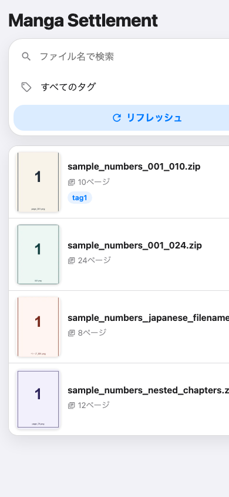
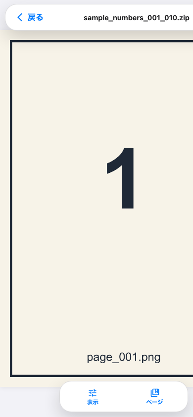

# Manga Settlement

`library/` に置いた zip 画像ライブラリを、家庭内 LAN のブラウザから閲覧するための Web アプリです。

## セットアップ

```bash
npm install
cp .env.example .env
npm run init
npm run build
npm run start
```

`.env` の `BASIC_AUTH_USER` と `BASIC_AUTH_PASSWORD` は必ず変更してください。

## 画面イメージ

同梱のデモ用 zip を使った本番画面のキャプチャです。

### トップページ



### ビューアー



## 使い方

1. `library/` に `.zip` ファイルを配置します。
2. `npm run start` でサーバーを起動します。
3. iPhone などから `http://PCのIP:3000` にアクセスします。
4. トップページの「リフレッシュ」で zip を取り込みます。

## 実装済み機能

- Basic 認証
- SQLite 初期化とマイグレーション
- `library/` 再帰スキャン
- zip 内画像の自然順ページ化
- 日本語ファイル名 zip の CP932/UTF-8 判定
- 画像 API、サムネイル API
- リフレッシュとサムネイル生成のプロセス内ジョブ
- ファイル名検索、単一タグ検索
- タグ・メモ編集
- 単ページ / 見開きビューア
- 右綴じ / 左綴じ、見開き開始位置調整
- タップ・スワイプ操作

## npm scripts

- `npm run init`: `library/`, `thumbnail/`, `data/` と SQLite schema を作成
- `npm run build`: サーバー TypeScript と React をビルド
- `npm run start`: ビルド済みアプリを起動
- `npm run dev`: サーバー watch と Vite dev server を起動
- `npm run typecheck`: サーバーとフロントエンドの型チェック

## コード構成

- `src/server.ts`: 起動、認証、API登録、フロントエンド配信
- `src/routes/`: Fastify の API エンドポイント
- `src/repositories/`: SQLite の読み書き
- `src/http/`: リクエスト値の扱いとレスポンス共通処理
- `src/media/`: 画像レスポンス用の補助処理
